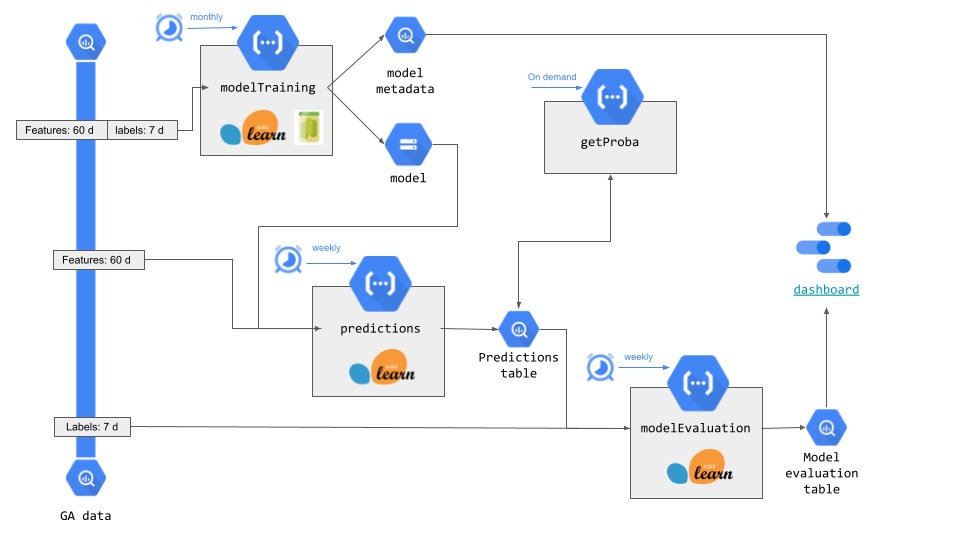

# Propensity Model / Model in production using GCP

## Long description
In this folder there on possible resolution to a client requierement: a predictive model based on Google Analytics data. The goal is to create the architecture needed to deploy the model in GCP. 

The architecture of the project is shown in the image below:

There are four `Cloud Functions`, one was created at each stage of the training (one for each request). 

- R1: 
  - Cloud function: modelTraining 
  - Folder: [00-ModelTraining](00-ModelTraining)
  - Execution: Monthly using Cloud Scheduler. 
  - Brief: This cloud function trains the model once a month using 60 days of data from google analytics, evaluates the performance and saves the model and model's metadata to be used after. 
  - Input: 
    - Raw data from Google Analytics 
  - Tasks: 
    - Query 
    - Data transformation (sklearn pipeline)
    - Model training and fitting
    - Model evaluation (precision, recall, f1, ROC AUC)
  - Output:
    - Model saved in a bucket in GCP (using pickle)
    - Table in bigquery with model's metadata (training date, metrics, name of the file in Storage). Table: `project.dataset.ma_model_training_metadata`

- R2: 
  - Cloud function: predictions 
  - Folder: [01-Predictions](01-Predictions)
  - Execution: Weekly using Cloud Scheduler. This cloud function is executed after the R3 Model evaluation 
  - Brief: This cloud function gets the last model available in the GCP bucket and uses 60 days of data from google analytics to predict the probability for the users to convert. Then updates a table in bigquery with new predictions.  
  - Input: 
    - Prediction's table in bigquery (data from previous predictions) `project.dataset.ma_predictions_table` 
    - Model's metadata table in bigquery 
    - Model object in storage
    - Preprocessor pipeline object in storage 
  - Tasks: 
    - Query into model's metadata to get the last model available
    - Get model from storage
    - Query into raw data from google analytics to get features 
    - Transform data using loaded sklearn pipeline 
    - Make new predictions
    - Get previous predictions from bigquery
    - Update table of predictions (users with new predictions are overwritten, new users are appended, user without new predictions keep the previous)
  - Output:
    - Updated predictions in bigquery
 
- R3: 
  - Cloud function: getProba 
  - Folder: [02-GetProba](02-GetProba)
  - Execution: on demand (HTTP request with parameter "user_id") 
  - Brief: This cloud function receives the user_id from the caller as an argument in the request and returns the probability of that user. 
  - Input: 
    - Prediction's table in bigquery 
    - HTTP request with an user_id
  - Tasks: 
    - Query 
  - Output:
    - JSON with user's probability (if any) and the date of prediction.

- R4: 
  - Cloud function: modelEvaluation 
  - Folder: [03-ModelEvaluation](03-ModelEvaluation)
  - Execution: Weekly using Cloud Scheduler. This cloud function is executed before the R1 predictions  
  - Brief: This cloud function gets the last predictions in bigquery and looks for the actual values (if the users finally have converted or not). Then it returns metrics about the model performance
  - Input: 
    - Prediction's table in bigquery (data from previous predictions) `project.dataset.ma_predictions_table` 
    - Data from google analytics (if the users have converted in last week)
  - Tasks: 
    - Query into raw data from google analytics to get labels for last week
    - Query into table of predictions to get probabilities for last week 
    - Join both tables using user_id
    - Calculate ROC_AUC, and TP, TN, FP, FN using a th of 0.5. Calculate f1, recall and precision.
    - Get previous predictions from bigquery
    - Update model evaluation table in bigquery `project.dataset.ma_model_evaluation`

- Offilne Folder
  - In this folder  there is a script to generate a binary file with the sklearn processor and to upload it to storage. This process was not include in the overall project and was run manually once.
 
## Installation
To test this locally, all the cloud function can be in the same a virtual environment. Create it with `python3 -m venv venv/`, activate it with `source venv/bin/activate` y after that install dependencies with `pip install -r requirements.txt`.
In order to deploy products, there are bash files (.sh) called deploy.sh in each folder. In order to use them, you first have to give execution permissions with `chmod 755 ./*.sh` and then run them with `./{name}.sh`. To create the scheduler for each CF, there is a `scheduler.sh` file that can be use as a template.
